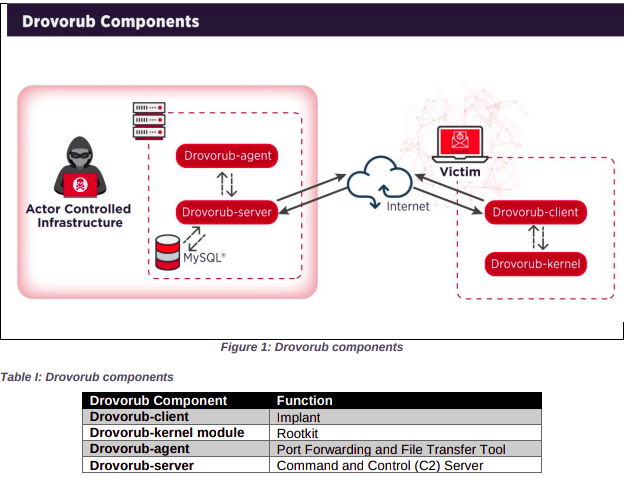

Recently (2020-08-13), the U.S. National Security Agency (NSA) and U.S. Federal Bureau of Investigation (FBI) issued a joint [technical security bulletin](https://media.defense.gov/2020/Aug/13/2002476465/-1/-1/0/CSA_DROVORUB_RUSSIAN_GRU_MALWARE_AUG_2020.PDF) detailing the disclosure of a malware family, "Drovorub". At 45 pages, it's quite lengthy for most people; however, in my experience, it was well worth the read -- especially the detection section on memory forensics. In this post I will attempt to briefly summarize the report and provide thoughts on defensive techniques as it pertains to the victim, an area where the report could have (in my opinion) shed more light.

- [Overview](#overview)
  - [Malware Architecture](#malware-architecture)
- [Defense Techniques](#defense-techniques)
  - [Prevention](#prevention)
    - [Restrict Privilege Escalation](#restrict-privilege-escalation)
    - [Cryptographic Signing](#cryptographic-signing)
  - [Detection and Response](#detection-and-response)
    - [Kernel-Level Auditing](#kernel-level-auditing)
    - [Network Monitoring](#network-monitoring)
    - [Memory and Disk Analysis](#memory-and-disk-analysis)
- [Conclusion](#conclusion)

## Overview

Per page 1 of the report, Drovorub is capable of the following:

| Tactic Name  | Technique                                     | MITRE ATTCK ID    | Drovorub Capabilities                                                |
| ------------ | --------------------------------------------- | ------------------| ---------------------------------------------------------------------|
| Execution    | Command and Scripting Interpreter: Unix Shell | T1059.004         | Execution of arbitrary commands as "root"                            |
| C2           | Proxy                                         | T1090             | Port forwarding of network traffic to other hosts on the network     |
| C2           | C2 Application Layer Protocol: Web Protocols  | T1071.0011        | Permit direct communications with actor controlled C2 infrastructure |
| Exfiltration | Exfiltration Over C2 Channel                  | T1041             | File download and upload capabilities                                |

Defense evasion is accomplished through a Linux kernel rootkit (T1014), provided that UEFI Secure Boot is disabled. An interesting observation that becomes apparent as one reads through the report is that the Drovorub is **capable** of these techniques, and is achieved through modularity.

### Malware Architecture

## Defense Techniques

This section will describe defensive techniques for systems engineers. As always, implementations may differ based on the organization's threat model. A combination of these techniques is ideal for defense-in-depth.

### Prevention

#### Restrict Privilege Escalation
Improperly configured privileged access management (PAM) for either root user or sudo, interactive or non-interactive, can trivially grant an adversary the ability to implant Drovorub. Improper PAM would not only grant the Drovorub kernel module the ability to load itself, but also to aid in its evasion, as Drovorub needs to read various files in the `/proc` pseudo-filesystem which may be read-restricted. However, PAM alone is not enough. Proper patch and vulnerability management, continuous security testing, command execution restrictions are all defensive methods that can assist here.

#### Cryptographic Signing
Signing and monitoring loaded kernel modules may provide some hardening; however, Drovorub can 'hook' itself to existing kernel functions, which removes the need to explicitly load in a kernel module, thus obviating this defensive technique. The NSA/FBI report suggests preventing untrusted kernel modules, which can occur in two key ways, as detailed below.

Linux provides native support for [cryptographically secure signing](https://www.kernel.org/doc/html/v4.15/admin-guide/module-signing.html#kernel-module-signing-facility) of kernel modules upon installation and verification upon module load. Under the hood, kernel module signing currently leverages X.509 public key encoding and RSA-{SHA1||SHA-224||SHA-256||SHA-384||SHA-512} for hashing. This kernel facility is supported in kernel versions 3.7+.

Additionally, "UEFI Secure Boot" can aid in forming a TCB (trusted computing base). The core tenet is that the secure boot implementation, for any given EFI program, can check if a cryptographic signature exists. EFI programs can be loaded into EFI shells which are present on most server hardware. For instance, arbitrary EFI binaries can be chainloaded into Grub. The "secure boot" methodology can be implemented by using a signed boot loaders such as PreLoader (Linux Foundation) or Shim (Fedora). [Rod Smith provides excellent documentation](http://www.rodsbooks.com/efi-bootloaders/secureboot.html) on managing EFI boot loaders of Linux, and specifically for secure boot.

### Detection and Response

#### Kernel-Level Auditing
Thankfully, the Linux kernel exposes an [audit subsystem](https://access.redhat.com/documentation/en-us/red_hat_enterprise_linux/7/html/security_guide/chap-system_auditing) which can trap relevant system calls such as `finit_module`. In fact, there is a [DoD STIG](https://www.stigviewer.com/stig/red_hat_enterprise_linux_7/2020-02-26/finding/V-79001) issued to audit this specific syscall. Again, if Drovorub hooks to existing system calls, it's possible that this detection can be bypassed.

As an aside, it may be worth investing in automated kernel module auditing in general, as other rootkits apart from Drovorub may not be as stealthy. This is because the kernel is a critical part of the Linux [TCB](https://csrc.nist.gov/glossary/term/trusted_computing_base).
- Static Kernel Modules: `/lib/modules/$(uname -r)/kernel/drivers/`
- Loaded ("Live" Static + Dynamic) Kernel Modules: `/proc/modules`

#### Network Monitoring
The NSA/FBI report explicitly mentions `185.86.149.125` as a discovered Drovorub C2 IPv4 address, although others may be used, as server infrastructure is relatively inexpensive these days. Additionally, snort NIDS/NIPS rules have been developed; review pages 35-37. 

Network detection evasion via WebSockets (Drovorub's protocol of choice) over SSL/TLS is a concern. However, if the victim organization intercepts this traffic before egress to the Internet, inspects the traffic via NIDS, then performs decisioning logic to deny that flow, possibly a preventative solution can be implemented before data exfiltration occurs. A tradeoff is that this method requires that high-performance infrastructure is deployed and instrumented properly. But, if implemented properly, this may be ideal for larger-scale datacenter or highly virtualized environments, as memory/disk analysis may prove to be harder to scale.

For host network monitoring, because network sockets require a file descriptor, `lsof` and `ss/netstat` can be used to associate network sockets, process names/PID, and connection state. Tradeoffs with this detection method is that Drovorub can filter out various TCP/UDP connection details. Any host-based firewall such as `iptables` or `firewalld`, which abstracts Linux's `netfilter`, can be bypassed by Drovorub, as Drovorub has its own netfilter hook which eventually gets prioritized first for traffic evaluation, for optimal evasion. Page 29 of the NSA/FBI report goes further in-depth on network hiding techniques.

#### Memory and Disk Analysis
To reiterate, persistence is achieved through `drovorub-kernel` kernel modules in Linux. Memory analysis perhaps the most accurate detection method, because `drovorub-kernel` achieves evasion by being resident in-memory. Memory and/or disk analysis should be performed out-of-band or when systems are rotated out-of-service, since memory acquisition (copying physical memory to another persistent storage device) can cause host instability. Scalability may be be a concern as well, as EDR daemons typically don't support live memory analysis, and offline memory/disk analysis require the automated acquisition,storage, and analysis infrastructure at scale. Starting on page 32 of the NSA/FBI report, are in-memory analysis techniques for DFIR personnel.

## Conclusion
`drovorub-client` and `drovorub-kernel` clearly exemplify evasive techniques that can trivially elude traditional Linux security monitoring methods. At large scale, through a combination of lower-level security monitoring of Linux server fleets, CSIRT teams may be able to detect and respond to these security events.