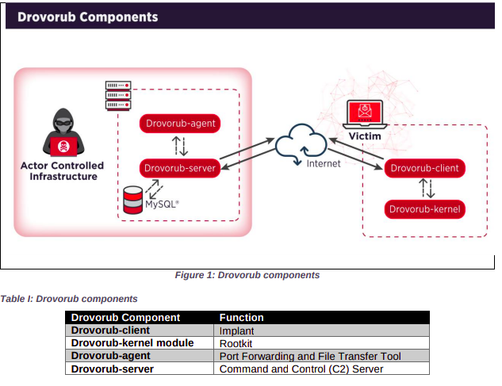
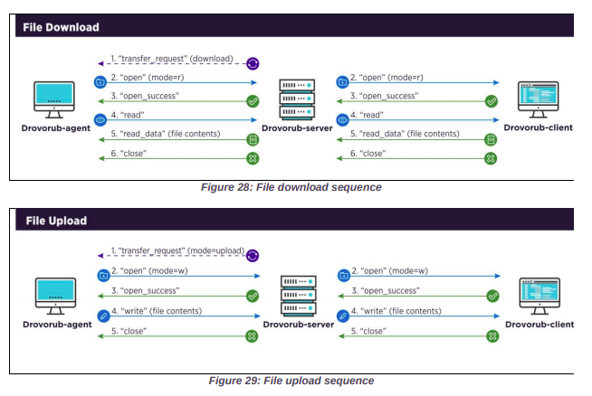

Recently (2020-08-13), the U.S. National Security Agency (NSA) and U.S. Federal Bureau of Investigation (FBI) issued a joint [technical security bulletin](https://media.defense.gov/2020/Aug/13/2002476465/-1/-1/0/CSA_DROVORUB_RUSSIAN_GRU_MALWARE_AUG_2020.PDF) detailing the disclosure of a malware family, "Drovorub". At 45 pages, it's quite lengthy for most people; however, in my experience, it was well worth the read -- especially the detection section on memory forensics. In this post I will attempt to breifly summarize the report and provide thoughts on infrastructure defense, an area where the report arguably did not discuss in-depth.

- [Overview](#overview)
  - [TL;DR:](#tldr)
  - [Malware Architecture](#malware-architecture)
- [Infrastructure Defense](#infrastructure-defense)
  - [Privileged Access Management](#privileged-access-management)
  - [Kernel Security](#kernel-security)
    - [Module Signing](#module-signing)
- [Infrastructure Monitoring](#infrastructure-monitoring)
  - [Network Monitoring](#network-monitoring)
  - [Kernel Module Monitoring](#kernel-module-monitoring)
- [References](#references)

## Overview

### TL;DR:

Per page 1 of the report, the Drovorub client implant is capable of the following:

| Tactic Name  | Technique                                     | ID         | Drovorub Capabilities                                                |
| ------------ | --------------------------------------------- | ---------- | -------------------------------------------------------------------- |
| Execution    | Command and Scripting Interpreter: Unix Shell | T1059.004  | Execution of arbitrary commands as "root"                            |
| C2           | Proxy                                         | T1090      | Port forwarding of network traffic to other hosts on the network     |
| C2           | C2 Application Layer Protocol: Web Protocols  | T1071.0011 | Permit direct communications with actor controlled C2 infrastructure |
| Exfiltration | Exfiltration Over C2 Channel                  | T1041      | File download and upload capabilities                                |

Defense evasion is accomplished through a Linux kernel rootkit (T1014), provided that UEFI Secure Boot is disabled. An interesting observation that becomes apparent as one reads through the report is that the Drovorub client is **capable** of these techniques, and is achieved through modularity.

### Malware Architecture

## Infrastructure Defense

This section will describe defensive techniques for systems engineers.

### Privileged Access Management
Improperly configured privileged access management for either root user or sudo, interactive or non-interactive, can grant an adversary the ability to implant Drovorub. It would grant the Drovorub kernel module the ability to not only load itself, but also to aid in its evasion, as it needs to read various files in the `/proc` pseudo-filesystem.

### Kernel Security
Signing and monitoring loaded kernel modules may provide some hardening, **but it is not a complete defensive strategy against Drovorub**, since Drovorub can 'hook' itself to existing kernel functions, which removes the need to explicity load in a kernel module.

#### Module Signing
Linux provides native support for [cryptographically secure signing](https://www.kernel.org/doc/html/v4.15/admin-guide/module-signing.html#kernel-module-signing-facility) of kernel modules upon installation and verification upon module load. Under the hood, kernel module signing currently leverages X.509 public key encoding and RSA-{SHA1||SHA-224||SHA-256||SHA-384||SHA-512}. This kernel facility is supported in kernel versions 3.7+.

## Infrastructure Monitoring

### Network Monitoring
The NSA/FBI report explicitly mentions `185.86.149.125` as a discovered Drovorub C2 IPv4 address, although others may be used. snort/yara rules have been developed; review pages 35-37. On-host, because network sockets require a file descriptor, `lsof` and `ss/netstat` can be used to associate network sockets, process names/PID, and connection state.

### Kernel Module Monitoring
As mentioned, persistence is achieved through `drovorub-kernel` kernel modules in Linux. Memory analysis is most applicable here, because `drovorub-kernel` achieves evasion by being resident in-memory. Memory analysis should be performed out-of-band or when systems(s) are out-of-service, since memory acquisition (copying physical memory to another persistent storage device) can cause instability. Scalability can be a concern as well, as EDR daemons typically don't support live memory analysis.

It may be worth auditing kernel modules in general, as other rootkits apart from Drovorub may not be as stealthy.
- Static Kernel Modules: `/lib/modules/$(uname -r)/kernel/drivers/`
- Loaded ("Live" Static + Dynamic) Kernel Modules: `/proc/modules`

Tools, which may very well parse the above files
- `lsmod`

## References
- [Russian GRU 85th GTsSS Deploys Previously Undisclosed Drovorub Malware, U.S. NSA/FBI](https://media.defense.gov/2020/Aug/13/2002476465/-1/-1/0/CSA_DROVORUB_RUSSIAN_GRU_MALWARE_AUG_2020.PDF)
- [(Cyber) GRU (XI): TTP, Lab52 (Threat Intel Division of S2 Groupo)](https://lab52.io/blog/cyber-gru-xi-ttp/)
- 
- [RedHat Security Advisory](https://access.redhat.com/articles/5320961)
- [Mitre ATTCK Framework](https://attack.mitre.org/)